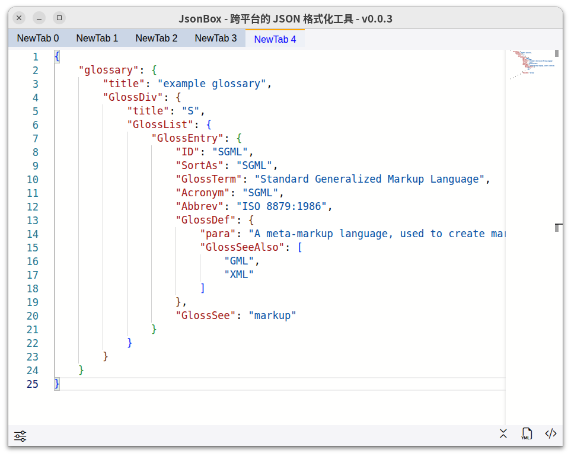
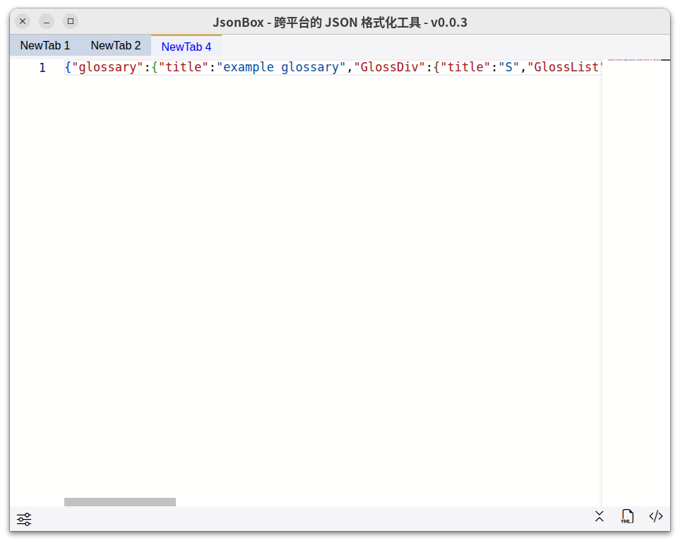
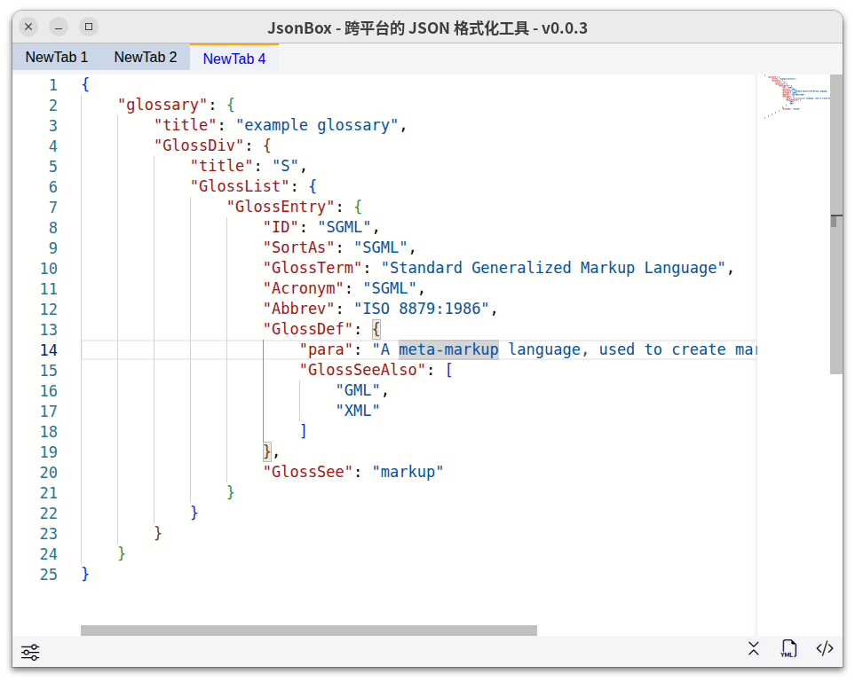
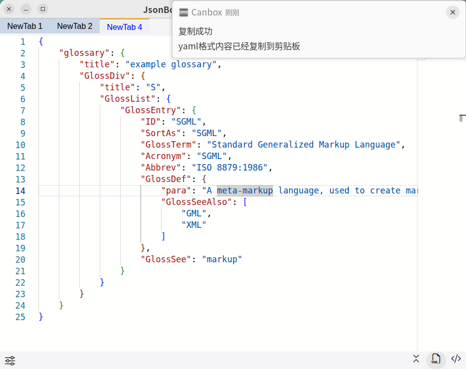
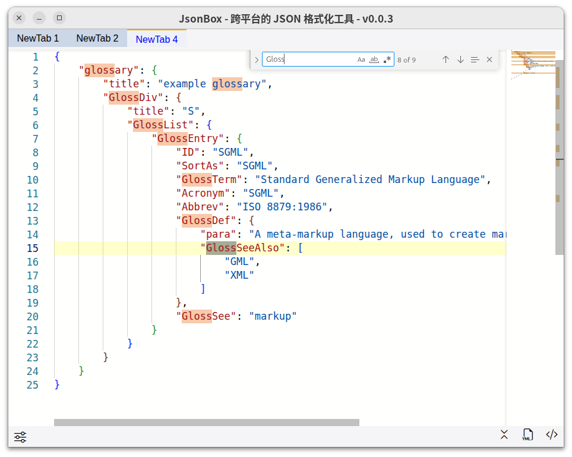
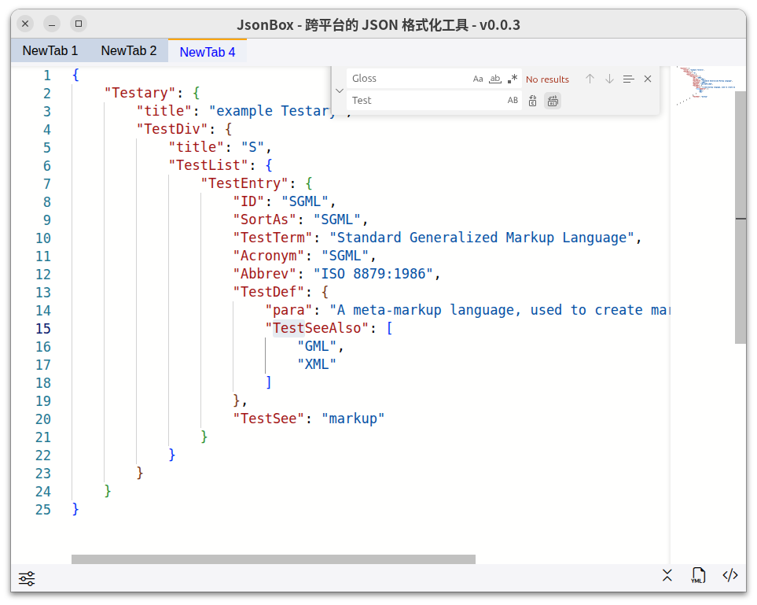
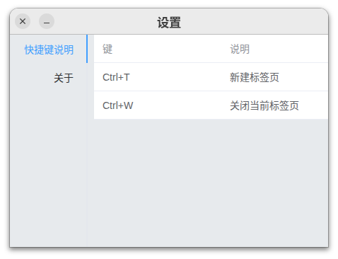
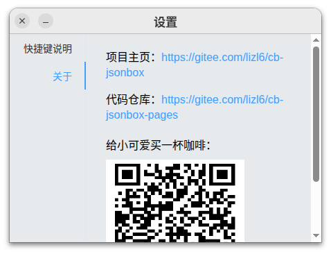

# JSONBox

[English](./README.md)

JSONBox 是运行在 **Canbox** 桌面应用平台上的 JSON 格式化工具。基于 Monaco Editor 打造，提供专业的 JSON 编辑、格式化、搜索替换以及 JSON ↔ YAML / XML 互转能力，让开发者在日常 JSON 数据处理中获得极致效率。

---

## 目录

- [APP 简介](#app-简介)
- [Canbox 平台介绍](#canbox-平台介绍)
- [UI 界面](#ui-界面)
- [获取与安装](#获取与安装)
- [使用指南](#使用指南)
- [许可证](#许可证)

---

## APP 简介

JSONBox 面向所有需要频繁与 JSON 打交道的开发者，解决以下痛点：

- **格式化与校验** —— 一键美化/压缩 JSON，实时语法高亮与错误提示。
- **格式互转** —— 支持 JSON ↔ YAML、JSON ↔ XML 快速转换，告别在线工具。
- **多标签页管理** —— 同时打开多个 JSON 文档，标签页之间自由切换，内容自动保存。
- **会话恢复** —— 关闭窗口后自动记住标签页、内容、窗口位置，再次打开无缝接续。
- **快捷键支持** —— 内置 Ctrl+T 新建标签页、Ctrl+W 关闭当前标签页等常用快捷键。

### 核心特性

| 特性        | 说明                                      |
| ----------- | ----------------------------------------- |
| JSON 格式化 | 一键美化、压缩 JSON，支持错误定位         |
| 格式互转    | JSON → YAML、JSON → XML，结果一键复制   |
| 搜索与替换  | Monaco Editor 内置强大的页内搜索/替换功能 |
| 多标签页    | 同时编辑多个文档，标签页自由管理          |
| 会话持久化  | 自动保存会话、恢复窗口位置与大小          |
| 快捷键      | 内置常用快捷键，操作更高效                |

---

## Canbox 平台介绍

Canbox 是一个轻量级的桌面工具集平台，用户可以在 Canbox 中安装并使用各种「小应用」，丰富电脑桌面工作流。

> 了解更多：[https://rexlevin.github.io/canbox-pages/](https://rexlevin.github.io/canbox-pages/)

- **轻量小巧** —— 单个小应用体积小，按需安装。
- **即装即用** —— 无需复杂配置，体验流畅的桌面应用。
- **生态丰富** —— 覆盖开发辅助、文本处理、效率工具等多种场景。

JSONBox 是 Canbox 生态中的 JSON 处理小应用，专为开发者设计。

---

## UI 界面

### 主界面

主窗口采用标签页式布局，顶部为多标签页栏，中间为 Monaco Editor 编辑区，底部为状态栏。

### 标签页管理

支持新建、关闭标签页，标签页标题自动递增命名。点击不同标签页即可切换编辑内容，每个标签页独立保存各自的 JSON 数据。

### JSON 格式化

选中需要格式化的 JSON 内容，通过工具栏按钮一键美化或压缩，编辑区实时展示格式化结果。

### 格式互转

支持将 JSON 内容转换为 YAML 或 XML 格式，转换结果自动复制到剪贴板，并提供系统通知确认。

### 搜索与替换

通过 Ctrl+F 唤出搜索面板，支持正则匹配、区分大小写、全字匹配等高级搜索选项。

### 设置页面

左侧菜单栏、右侧内容区的布局，包含常用设置、快捷键说明、关于信息。

---

## 获取与安装

### 前提条件

- 已安装 **Canbox** 桌面平台客户端。

### 安装步骤

1. 打开 Canbox 客户端。
2. 进入小应用市场或本地安装入口。
3. 搜索 **JSONBox** 并点击安装。
4. 安装完成后，在 Canbox 首页点击 JSONBox 图标启动。

> 如果你还没有 Canbox 客户端，请先获取并安装 Canbox 平台后再安装 JSONBox。

---

## 使用指南

### 快速上手

1. **启动 APP** —— 在 Canbox 首页点击 JSONBox 图标。
2. **创建标签页** —— 按 `Ctrl+T` 新建标签页，在编辑区输入或粘贴 JSON 内容。
3. **格式化 JSON** —— 通过工具栏按钮或快捷键一键格式化。
4. **格式转换** —— 使用工具栏菜单将 JSON 转为 YAML 或 XML 并复制。
5. **搜索与替换** —— 按 `Ctrl+F` 打开搜索面板，输入关键词进行搜索或替换。

### 快捷键速览

| 快捷键     | 功能           |
| ---------- | -------------- |
| `Ctrl+T` | 新建标签页     |
| `Ctrl+W` | 关闭当前标签页 |

> 更多快捷键请在 APP 内「设置 → 快捷键说明」中查看。

### 设置说明

进入 APP 右上角的设置页面，可配置：

- **保存会话** —— 开启后，关闭 APP 时自动保存所有标签页及内容。
- **恢复上次关闭时窗口位置和大小** —— 开启后，下次启动 APP 恢复之前窗口状态。

---

## 许可证

Apache 2.0
